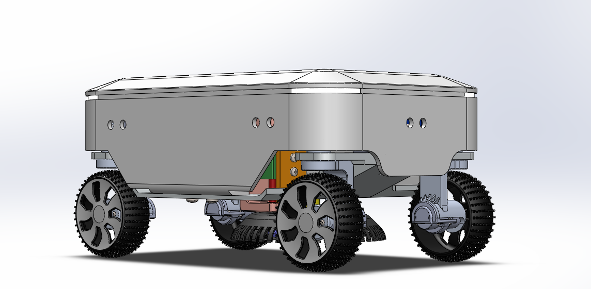

# ROBOMOW 1 – Autonomous Lawn Mower Robot

ROBOMOW 1 is an autonomous grass-cutting robot designed and developed by engineering students at École Polytechnique de Tunisie. The robot is equipped with computer vision, ultrasonic sensors, and a custom mechanical system to autonomously mow lawns, avoid obstacles, and adapt to various terrains.

## Project Goals

The objective was to build an affordable autonomous lawn mower capable of:

- Navigating independently using computer vision and ultrasonic sensors
- Avoiding obstacles in real time
- Adapting to different terrains via a custom suspension system
- Adjusting blade height for uniform grass cutting
- Displaying status and controls through an LCD-based user interface

## Main Features

### Autonomous Navigation
- Grid-based terrain coverage
- Bidirectional zigzag mowing pattern

### Obstacle Avoidance
- Real-time detection using ultrasonic sensors

### Adjustable Cutting System
- Brushless motor for blades
- Height adjustment via stepper motor

### Terrain Detection
- Field boundary detection with color sensors

### User Interface
- 16x2 I2C LCD screen displaying:
  - Battery level
  - Status messages
  - Error indicators

## Technical Components

| Component        | Description                                       |
|------------------|---------------------------------------------------|
| Microcontroller  | Arduino Mega                                      |
| Vision System    | External YOLOv8-based object detection            |
| Sensors          | TCS3200 color sensors, ultrasonic distance sensors|
| Actuators        | 4 DC motors, 4 servos, 1 stepper motor, 1 brushless motor |
| Interface        | I2C 16x2 LCD display                              |
| Simulation       | Tinkercad logic and sensor simulation             |

## Mechanical Design

### Chassis & Suspension
- Designed with SolidWorks and Blender
- Equipped with custom damping springs
- Directional control via gear-actuated servos

### Cutting System
- High-speed brushless motor
- Safety-optimized adjustable blade mount
- Height control via stepper motor

## Computer Vision

- Model: YOLOv8 (Large), trained on school field imagery
- Deployment: External inference (PC), communicating with Arduino
- Purpose: Detect terrain zones and close-range obstacles

## Simulation and Testing

- Logic and sensor behavior simulated using Tinkercad
- Validated motor control, sensor readings, and LCD output before hardware implementation

## Contributors

- Hamdane Brini  
- Chahine Ghanoudi  
- Omar Kammoun  
- Mohamed Dridi  
- Zakaria M’hemed  
- Nidhal Ben Rajeb  

Supervised by:  
- M. Ben Hassena Mohamed Amine  
- Mme. Rezgui Taysir

## Visuals and Models

The mechanical schematics and 3D models were created using Blender and SolidWorks. These are available in the project report and media directory for better understanding and communication of the project.

---

For full source code, schematics, and models, please refer to the respective folders in this repository.
